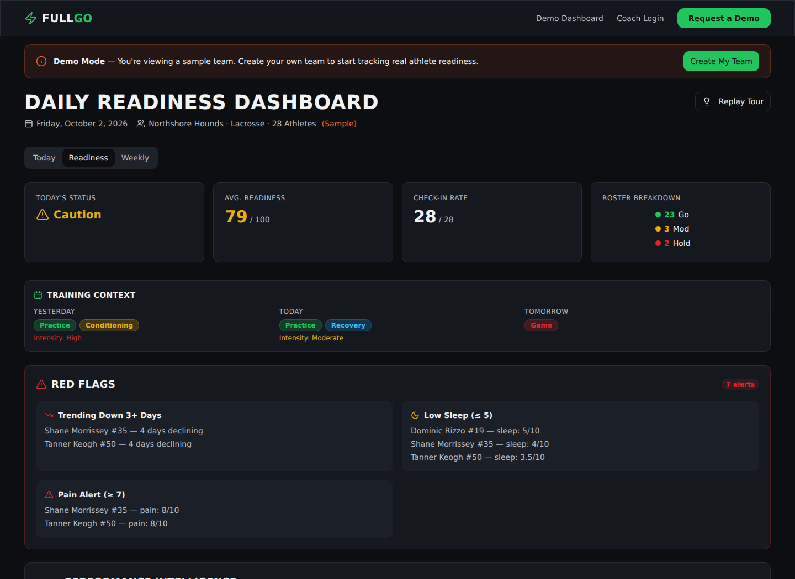
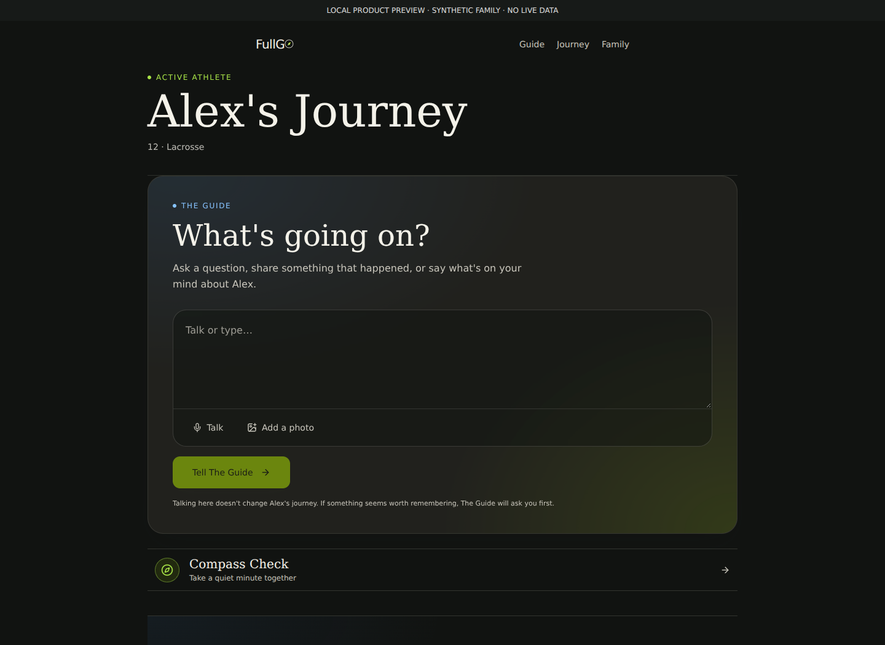
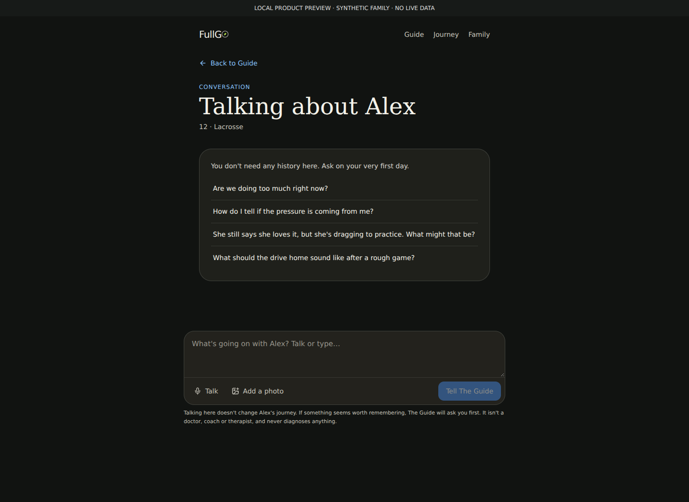
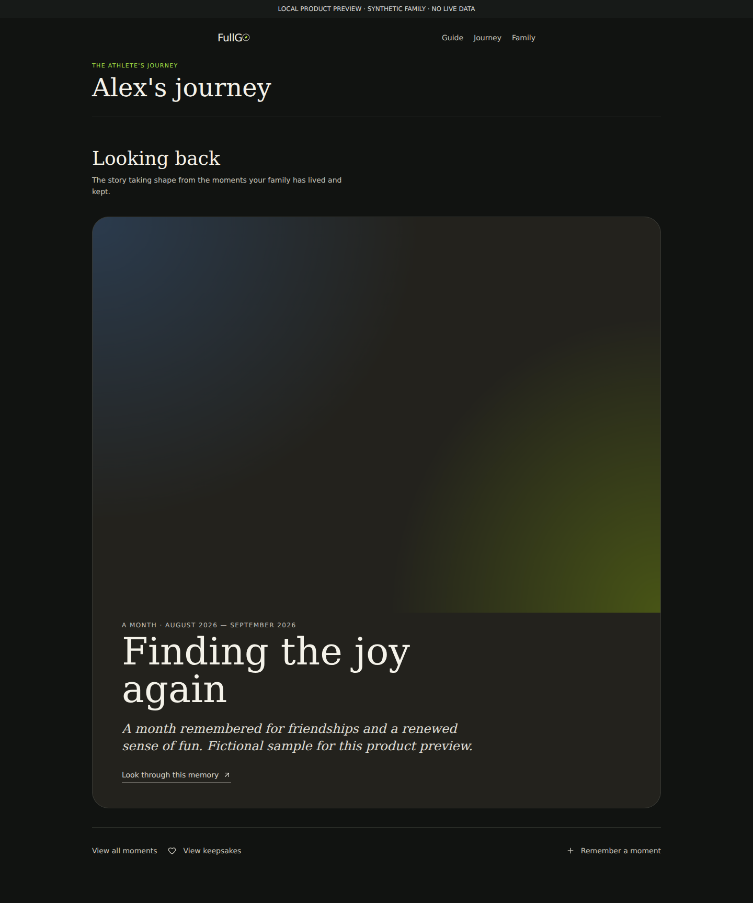

# FullGo: From Team Readiness to Family Perspective

### A founder-led product case study by James Dulkerian, DPT

**Customer discovery · Product strategy · Workflow design · AI-assisted development · Testing · Product communication**

[Visit FullGo](https://fullgoperformance.com) · [Original platform](docs/team-readiness-platform.md) · [Feature walkthrough](docs/guide-memory-feature.md) · [Product demonstration outline](docs/product-demo.md)

> I started with a question about athlete readiness. The product evolved toward a different question: how can a parent make thoughtful decisions throughout a child's sports journey without turning childhood into another performance dashboard?

## At a glance

| | Summary |
|---|---|
| My role | Founder and product lead: problem definition, discovery, scope, workflows, product messaging, hands-on testing, and release coordination |
| Project period | 2024–present; this case study reflects the project through October 2, 2026 |
| Original direction | A team-oriented athlete-readiness concept for coaches and sports organizations |
| Current direction | A private, parent-directed youth-sports guidance and memory product |
| Delivery | Live web experience; iOS build approved for TestFlight beta distribution |
| Stage | Early pilot preparation and validation; paid demand and sustained adoption remain unproven |
| Build approach | AI-assisted development using Lovable, with Supabase and an Expo/EAS mobile workflow; GitHub for source management |

**What this repository is:** a public product portfolio, not the application source code. It documents decisions, delivery work, and a representative feature. It contains no family records, private conversations, credentials, or internal legal documents.

## Product evolution in pictures

These screenshots were captured from the two supplied application archives, rendered locally on October 2, 2026. The historical dashboard uses the original app's built-in sample team. The family screens use the supplied UI components with a disconnected, fictional family fixture. They illustrate interface design, not production usage or verified AI/backend behavior. No live account was accessed. Fonts may differ slightly from the hosted app because external requests were blocked during capture.

### Then: a coach's team-readiness view

**Original coach platform — built-in demo data.** Readiness summaries, roster status, training context, and alerts make a team's reported signals visible before practice. The discovery challenge was getting busy staff and athletes to adopt another recurring workflow.

### Now: a parent's place to ask for perspective

**Current family product — local sample-data preview.** The Guide becomes the primary action; a quiet Compass Check remains secondary. The family can begin with a question rather than committing to nightly reporting.

### Reducing the blank-page problem

**Current conversation entry — local sample-data preview.** Suggested questions make the first interaction approachable. The interface explains that conversation does not automatically change the child's Journey and that the Guide does not diagnose. This image shows entry to the conversation, not a generated AI answer.

### Preserving meaning rather than tracking every activity

**Current Journey presentation — local sample-data preview.** A fictional monthly reflection demonstrates the memory-oriented layout. The gradient is the application's existing no-photo fallback. The reflection was supplied as a display fixture, not generated from real family activity.

[How these previews were captured](docs/screenshot-notes.md)

## 1. The original hypothesis: make readiness useful to teams

My background in physical therapy, sports, coaching, and practice ownership gave me firsthand experience with the gap between what athletes experience and what others can observe. Fatigue, confidence, recovery, and a changing relationship with sport are not always visible in a game result.

The original FullGo direction explored a team-oriented readiness experience: gather athlete input, make it understandable, and help coaches or sports organizations use it. This was a product hypothesis, not an established finding that teams would adopt or pay for it.

I explored the problem with parents, coaches, athletic directors, and sports-technology stakeholders. That work informed the product's direction, but I did not run a formal research study or maintain a complete interview dataset. I therefore do not claim an interview count, representative sample, or quantified validation.

### What I built in the coach-focused platform

Source inspection of the historical `fullgo-teampulse` snapshot confirms a substantial workflow, not only a landing page:

| Component | Behavior represented in the source | Product purpose |
|---|---|---|
| Athlete check-in | Team-specific link, jersey number, 1–10 sleep quality, energy, soreness, stress/mood, and pain inputs; optional HRV and notes | Gather athlete-reported context |
| Coach workspace | Team setup, roster management, readiness summary, athlete detail charts, team trends, and red-flag views | Make individual and team signals visible |
| Interpretation | Rule-based GO / MODIFY / MONITOR classifications with criteria and suggested follow-up ownership | Turn signals into understandable coaching prompts |
| Daily briefing | Prioritized athlete items and coaching-action recording | Reduce the distance between information and action |
| Reporting and context | Weekly report and training/schedule context components | Interpret observations over time and against the team's activities |
| Demonstration | Sample team, athlete histories, and a demo-mode toggle | Let someone explore the value before configuring a real team |

The daily-briefing implementation separates rule-based selection from AI summary: rules determine what surfaces; AI summarizes the selected briefing. The rule engine also distinguishes coach follow-up from medical escalation and does not issue automated medical clearance or diagnoses.

These are code-observed capabilities, not claims of clinical validation, successful customer deployment, or demonstrated injury prevention. An integrations interface lists external providers, but its presence alone does not prove working third-party integrations.

[Read the historical workflow analysis](docs/team-readiness-platform.md).

## 2. What coaches and athletic directors told me

In conversations about the original coach-focused Team Readiness platform, I encountered four recurring adoption obstacles:

| Founder-reported feedback | What it challenged | How it influenced the next direction |
|---|---|---|
| Coaches and athletic directors were already busy and did not have time for another tool | The assumption that useful readiness information would earn staff attention | Reduce dependence on staff review and put value directly in the family's hands |
| Some organizations had recently instituted new applications | The assumption that there was room for another recurring workflow | Treat app fatigue and workflow burden as product constraints |
| Public-school approval was difficult | The assumption that a coach's interest could translate quickly into adoption | Explore an adult parent-directed product with fewer institutional adoption dependencies |
| Some wanted objective athlete measurement to explain team-selection decisions to parents | The assumption that subjective readiness input addressed their priority problem | Recognize a different job rather than stretch readiness data into an objective selection claim |

Nightly athlete input was another concern. The original value depended on athletes repeatedly supplying information and staff having capacity to use it. I came to see friction on both sides of that loop.

These findings are my account of informal discovery, not verbatim interview transcripts or a quantified market study. The request for objective selection evidence came from some contacts; I do not generalize it to every coach or school.

**My decision:** I did not pivot toward ranking athletes or defending roster cuts. That would have required a different product, measurement evidence, and fairness considerations. I instead explored a family-centered problem consistent with my interests in perspective, development, and a sustainable relationship with sport.

## 3. Reframing the problem

The shift was not simply from one interface to another. It changed the customer, the central job, and what the product should ask of people.

| Initial framing | Current framing | Product implication |
|---|---|---|
| Help a team understand readiness | Help a parent gain perspective | Begin with the parent's actual question |
| Collect structured athlete input | Learn meaningful context through conversation and optional input | Do not make a daily check-in a prerequisite for value |
| Make information visible to an organization | Keep context in a family-controlled workspace | Design sharing around family permission |
| Summarize the athlete's current state | Understand the longer journey | Preserve meaningful moments without retaining every observation |
| Support a performance-oriented decision | Help the family see tradeoffs | Offer perspective rather than scores or directives |

These are **my product judgments informed by discovery and iteration**. They are not claims that controlled experiments proved the family model superior.

Three questions shaped the reframing:

- **Who owns the decision?** Parents face choices about commitments, recovery, spending, pressure, and their child's relationship with sport. I chose to center that decision-maker.
- **What earns continued use?** A dashboard requires data before it can return value. I wanted a useful first conversation before asking the family to build a record.
- **What should technology preserve?** A family's story can be valuable; an exhaustive record of childhood observations can become burdensome and intrusive.

## 4. The product decisions—and what I gave up

### Make perspective the front door

The Guide became the primary entry point. A parent can ask about a real situation rather than start by completing a readiness questionnaire. Compass Check remains an optional supporting interaction.

**Tradeoff:** fewer standardized inputs and less dependence on daily engagement. In return, the experience aims to fit the family's needs rather than impose a tracking routine.

### Preserve meaning instead of everything

I defined a distinction between a conversation, approved context, and a Journey memory. The governing principle is **“Preserve the Journey. Delete the Exhaust.”** The principle expresses a product requirement; it is not a claim that every retention policy or infrastructure setting is already finalized.

**Tradeoff:** the product cannot simply treat every message as useful permanent context. Curation, permission, correction, and deletion become part of the product design.

### Keep the athlete's perspective attributable

A parent's observation is not the same as something the athlete said. The product contract distinguishes direct athlete input, parent-reported words, parent observations, and AI inference.

**Tradeoff:** more explicit information handling, but fewer opportunities for the AI to convert an interpretation into an apparent fact.

### Bound the AI's role

The Guide is intended to support family judgment, not diagnose, grade a child, predict talent, or replace a professional. Uncertainty should remain visible.

**Tradeoff:** some impressive-sounding outputs are unacceptable. A restrained, useful answer is preferable to confident personalization unsupported by evidence.

## 5. The current experience

| Product area | Intended job | Representative experience |
|---|---|---|
| **Guide** | Provide perspective on a current decision | Ask a question; receive bounded guidance informed by relevant family context |
| **Journey** | Preserve meaningful moments and context | Save memories and photos; revisit the evolving story |
| **Family** | Control the workspace | Manage athlete profiles, caregivers, preferences, and privacy controls |
| **Compass Check** | Add optional context | A lightweight check-in when it serves the family—not a required daily score |

The public website is available at [fullgoperformance.com](https://fullgoperformance.com). Authenticated features require an account. The mobile build has reached approved TestFlight beta distribution; that is distinct from a public App Store launch or evidence of broad adoption.

The reviewed `familysport-hub` source snapshot contains family-focused routes and components, including Guide, Journey, Family, and memory-proposal interactions. The separate `fullgo-teampulse` snapshot supplies the historical coach-platform evidence described above. Source inspection does not establish production availability or prove that every flow works end-to-end.

This portfolio deliberately does not include screenshots from real families. The linked demonstration outline describes how to show the product using synthetic data.

## 6. A feature example: conversation is not consent to remember

Personalization creates a practical product problem: how can an AI learn useful context without silently making everything permanent?

I translated the principle into a bounded workflow:

1. Answer the parent's current question.
2. If appropriate, propose one explicit, useful fact to remember.
3. Show its source accurately.
4. Let the parent approve or decline.
5. Keep the conversation useful either way.

The [feature walkthrough](docs/guide-memory-feature.md) includes the problem, requirements, an illustrative scenario, acceptance criteria, and a verification plan. It distinguishes the specified behavior from current implementation evidence and tests that still need a recorded execution.

## 7. What I owned—and how the work was built

| Contributor | Contribution |
|---|---|
| **Me** | Product direction, stakeholder discovery, prioritization, user flows, product principles, prompts and implementation instructions, acceptance review, troubleshooting, positioning, and release decisions |
| **Earlier developer support** | Contributed to an earlier application; that work is distinct from my subsequent hands-on development and delivery work |
| **AI-assisted tools** | Assisted with coding, drafting, debugging, and implementation; generated changes still required direction, review, and verification |
| **Managed platforms** | Supabase supplied backend services; Lovable supported web development/deployment; Expo/EAS supported mobile build and distribution workflows |
| **Legal support** | Counsel review was coordinated for release policies and disclosures; I do not represent that work as my legal expertise |

I am not presenting myself as the sole author of every line of code or as an experienced aerospace engineer. My contribution is owning the product problem and working through the details needed to deliver it.

One concrete delivery difficulty was web/mobile alignment. During mobile setup, the installed experience did not initially match the intended current product. That required checking which build and web destination were in use, aligning the mobile configuration, and verifying the resulting experience. The lesson was operational: a successful build is not sufficient evidence that the correct product was delivered.

## 8. Outcomes, limitations, and next decisions

### Delivered milestones

- A working web experience and a product direction expressed in written requirements.
- An iOS build advanced through TestFlight approval.
- A documented contract for Guide behavior, memory, provenance, Journey composition, and web/mobile parity.
- A product-feedback mechanism designed to avoid attaching account or athlete identifiers to stored feedback records.

### What remains unproven

- Whether families experience enough recurring value to return voluntarily.
- Whether longitudinal context improves guidance over a generic AI conversation.
- Willingness to pay and a sustainable acquisition model.
- Reliability across a broader range of families, prompts, devices, and failure conditions.
- Completion and verification of all release, privacy, and retention requirements.

### Proposed validation—not reported results

| Question | Evidence I would collect | Decision it informs |
|---|---|---|
| Does the first conversation help? | Time to first useful response and a brief usefulness rating | Onboarding and Guide improvements |
| Does memory add value? | Scenario-based comparison with and without approved context | Memory scope and prioritization |
| Do people feel in control? | Observed approval, correction, and deletion tasks | Permission and usability changes |
| Do families return for a real need? | Voluntary repeat use plus interviews about why | Product value and future business model |
| Does the product fail appropriately? | Recorded tests of attribution, unsupported inference, timeouts, and account isolation | Release readiness |

## 9. What I would bring to a product team

This project required me to move between customer needs, product decisions, technical constraints, explanatory writing, and testing. The work I want to continue is turning messy input into clear requirements, learning a product deeply enough to demonstrate it, and following through from a reported problem to a verified improvement.

The domain here is youth sports. The transferable discipline is understanding the user's world, making decisions explicit, preserving the source of information, and checking that what was delivered matches what was intended.

---

**About the author:** James Dulkerian, DPT — founder of FullGo Performance and Pioneer Physical Therapy. My experience combines clinical practice, service-business ownership, customer communication, and hands-on AI-assisted product development.

**Portfolio scope:** Descriptions reflect founder experience, direct source inspection of coach-focused and family-focused application snapshots, and selected project records through October 2, 2026. No performance, revenue, research, or adoption claims are made for FullGo beyond the stated delivery milestones. Application code and internal records remain private. All rights reserved.
