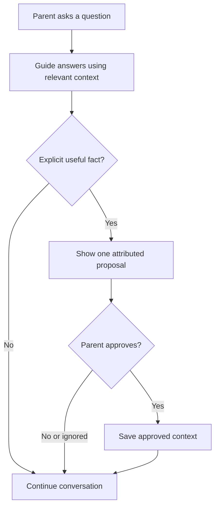

# Feature walkthrough: Parent-approved Guide memory

[Back to the case study](../README.md)

**My role:** product owner and acceptance reviewer.  
**Evidence level:** documented product requirements and selected implementation-review records. The checklist below is a portfolio verification plan, not a claim of a fully executed test suite.

## Problem

A parent can reveal something useful during a conversation. Saving the entire conversation creates unnecessary durable information; saving an AI interpretation can misrepresent the athlete. Never remembering anything limits personalization.

**Desired outcome:** preserve an explicit fact that improves future guidance, with the parent's approval and truthful attribution.

## Illustrative scenario

The following is synthetic, not a customer quote:

> “My daughter told me she still loves practice, but doesn't want to add another travel team this season.”

A useful response would address the decision and its tradeoffs. A possible memory proposal could summarize the reported preference and label it as **parent-reported**, rather than direct athlete input.

The AI should not turn that statement into “the athlete is burned out,” a permanent trait, or a diagnosis. It should not manufacture a quote or claim that the child entered the statement herself.

## Requirements

| Requirement | Rationale |
|---|---|
| Respond to the current question before proposing memory | Immediate usefulness must not depend on building a profile |
| At most one candidate fact per completed response | Keep the interaction bounded |
| Candidate must be explicit, relevant, concise, and materially distinct | Reduce noise and duplication |
| Parent approval before durable storage | Disclosure in conversation is not blanket consent to remember |
| Preserve truthful provenance | An observation or inference is not the athlete's own statement |
| Decline or ignore without impairing the conversation | Permission must be meaningful |
| Do not automatically create a visible Journey entry | Guidance context and family storytelling have different jobs |
| Safe fallback creates no memory proposal | Failure must not generate unsupported durable information |

## Logical workflow

This is a product-level workflow, not an exact application architecture diagram.

## Implementation approach

The September product contract separates current conversation, approved Guide context, Journey material, and composed stories. It defines distinct provenance categories rather than asking a client interface to infer the source later.

Selected implementation-review records describe parent-approved Guide memory and minimized server-side AI processing. They also identify the distinction between production deployment and independent repository state. I treat those as implementation evidence at a point in time—not proof that every requirement passes in every environment.

My contribution was to specify the intended behavior, express constraints in implementation instructions, review the resulting experience, and identify where verification was still needed. AI tools assisted implementation; my responsibility was deciding what acceptable behavior meant.

The supplied family-app snapshot also contains the Guide route's memory-decision integration (`decideProposal`) and provenance labels. This supports the presence of a permission/attribution workflow in source. I have not executed the application or verified backend behavior as part of preparing this portfolio.

## Acceptance and failure checks

| Scenario | Expected behavior |
|---|---|
| Parent reports the athlete's words | Retain parent-reported attribution; no fabricated quotation |
| Parent offers an interpretation | Do not upgrade it into direct Athlete Voice |
| Guide infers a pattern from one incident | Do not save the inference as fact |
| Similar approved context already exists | Avoid redundant proposal |
| Parent declines or ignores | Continue normally; no approved durable memory created |
| Parent approves | Store the intended fact with its source and correct family/athlete association |
| Model timeout or malformed output | Safe response; no memory proposal |
| Web and mobile use the same scenario | Equivalent permission and attribution behavior |
| Another family attempts access | No cross-family visibility |
| Parent corrects or withdraws context | Verify that later guidance reflects the applicable correction/deletion behavior |

**Execution status:** these checks need an explicit run record before they can be reported as passed. A production review is not a substitute for a repeatable acceptance test.

## Next iteration

Observe whether parents understand the proposal and attribution without explanation. Compare later answers with and without approved context. Record misleading proposals, duplicate facts, and correction failures. Use those findings to decide whether to change the proposal wording, eligibility rules, or interaction—not simply add more memory.

**Lesson:** useful AI personalization requires product judgment about what should be remembered, not merely a technical ability to store it.
