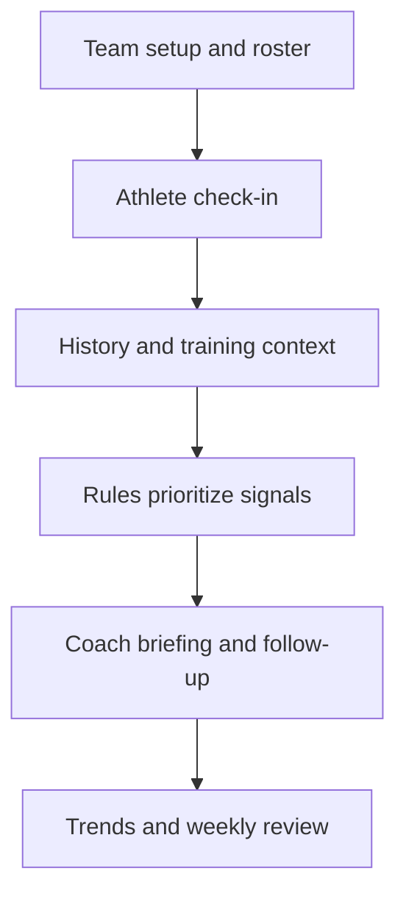

# Historical platform: Team Readiness for coaches

[Back to the case study](../README.md)

**Historical source snapshot:** `fullgo-teampulse`, supplied by the founder. Archive date and original release date are not established here.  
**Verification:** static source inspection; no backend connection or end-to-end execution was performed for this portfolio.

## The original job to be done

Help a coach notice athlete-reported changes and decide whom to speak with, monitor, or refer for appropriate professional input. The workflow sought to move from a roster of numbers toward a manageable daily briefing.

## How the experience was structured

1. **Set up the team and roster.** The coach workspace includes team creation and athlete management.
2. **Collect athlete input.** A team-specific check-in uses jersey number and subjective 1–10 ratings for sleep, energy, soreness, stress/mood, and pain. Optional HRV and free-text notes add context.
3. **Review patterns.** Readiness summaries, athlete detail charts, and team trend views expose individual and aggregate information.
4. **Prioritize follow-up.** A rule engine produces GO, MODIFY, and MONITOR classifications, including explanatory criteria and coach-versus-medical follow-up authority.
5. **Act and revisit.** The daily briefing can record coach actions; weekly-report and training-context components support longer-view discussion.

## A design choice worth explaining

The daily briefing separates decision logic from generated prose. Rules decide which items surface; an AI summary communicates the selected briefing. This establishes a clearer boundary than letting an unrestricted model decide both what matters and what to say.

That boundary does not make the classifications clinically validated. Subjective inputs, thresholds, missing data, and scale interpretation still require evaluation. Readiness ratings also cannot establish objective athletic ability or justify roster selection.

## Product evaluation questions

These are retrospective evaluation questions, not reported test failures or completed validation results:

| Question | Why it matters |
|---|---|
| Will athletes complete the check-in consistently and honestly? | The coach's value depends on the input loop |
| Does the briefing save time or create more review work? | Limited coach capacity is an adoption constraint |
| Do staff understand the limits of classifications? | A suggested follow-up should not appear to be clearance or diagnosis |
| Are energy/fatigue and inverse symptom scales interpreted consistently? | Mixed scale directions need explicit verification across collection and analysis |
| Does missing input remain distinguishable from reassuring input? | Absence of information should not imply readiness |
| Can the organization approve another system? | Buyer approval can block adoption even when the user sees value |

## What discovery changed

James reports that coaches and athletic directors cited limited time, recently introduced applications, and difficult public-school approval. Some sought objective assessment for explaining selection decisions to parents—a different problem from athlete-reported readiness.

The nightly-input model also introduced recurring work for student athletes. The product needed both athlete participation and staff attention, in an environment already using multiple tools.

The resulting decision was to explore a parent-directed experience centered on a question the family already had. Structured check-ins became optional supporting context; perspective became the entry point; family-controlled memories replaced a team-monitoring model as the product's center.

**Transferable lesson:** a useful feature set is not enough. The product must fit the user's available attention, the organization's approval path, and the specific decision the customer wants help making.

## Source boundaries

The reviewed files include the historical check-in and dashboard pages, rule engine, daily briefing, and integrations interface. Code shows intent and implementation structure; it does not establish deployment, adoption, outcomes, or full integration functionality. No raw source code or environment files are published in this portfolio.
